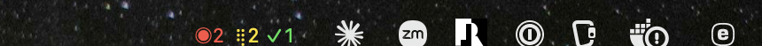
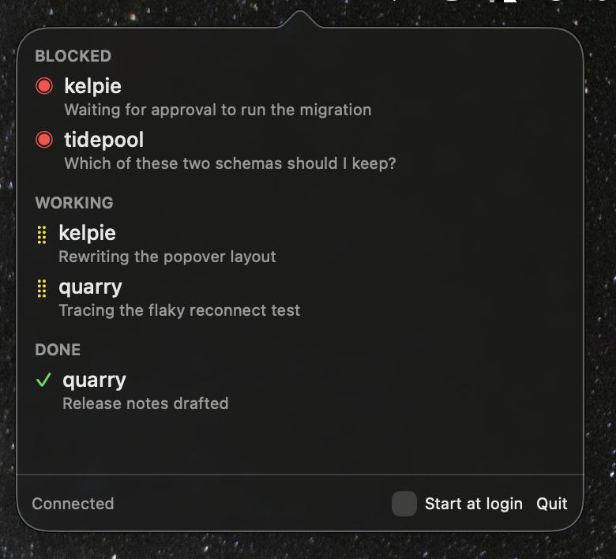

<div align="center">


<h1>Kelpie</h1>

<p>
A macOS menu bar app that shows how your
<a href="https://github.com/herdrdev/herdr">herdr</a> coding agents are doing:
how many are blocked, how many are working, how many are done.
</p>

<p>
<a href="#installation">Install</a> ·
<a href="#why-it-exists">Why it exists</a> ·
<a href="ROADMAP.md">Roadmap</a>
</p>



</div>

## The name

An Australian Kelpie is a herding dog. It watches the flock on its own, without
waiting to be told. herdr drives the flock; Kelpie watches it while you are
looking somewhere else. That is why the app icon is a dog.

## Why it exists

herdr used to animate its agent spinners, and then
[removed them](https://github.com/herdrdev/herdr/commit/81f355fadac7d0d45b077dfc28f9f679add6bbb6)
in v0.8.0. The animation forced a full redraw for every attached client, so the
cost grew with both the pane count and the client count — enough that a headless
server with three clients attached
[sat at 16-23% of a CPU core](https://github.com/herdrdev/herdr/issues/1862).
Kelpie brings the animation back from outside herdr, where one process redraws a
few glyphs in the menu bar and no herdr client pays for it.

## What the menu bar segments mean

The menu bar item shows up to three segments. A segment appears only when its
count is above zero.

| Segment | Meaning |
|---|---|
| `◉n` (red, blinks once ignored) | `n` agents are blocked, waiting on you |
| `⣾n` (yellow, animated) | `n` agents are working |
| `✓n` (green) | `n` agents are done |

<div align="center">

</div>

Idle agents are not counted in the menu bar. They still appear in the popover.
The menu bar is reserved for states that want your attention.

When nothing is blocked, working or done, the item shows a small dog icon. It
is drawn as a template image, so macOS keeps it readable against any menu bar
background.

The spinner animates only while an agent is working, and the blocked count
blinks only once it has been ignored. The animation timer runs in those two
cases and no others, which is what keeps the cost low. If Reduce Motion is
turned on, the spinner is replaced by a static glyph.

### The blocked segment gets louder

A red number is easy to start ignoring, so it gets louder on its own.

- For the first minute it is plain red.
- After a minute it inverts once a second: white on a red fill.
- After five minutes it inverts every 0.4 seconds.

Those two thresholds match the first two reminder intervals below. Answering
the agent stops it at once, and an agent that unblocks and blocks again starts
over at plain red.

This does count agents that were already blocked when Kelpie launched. A banner
for those would be noise, but a blinking number is not: an agent blocked before
launch is exactly the kind that gets forgotten. Under Reduce Motion the segment
stays inverted instead of blinking.

## What clicking a row does

Clicking a row in the popover sends herdr's `agent.focus` for that pane. Kelpie
then brings the terminal running herdr to the front, so you land on the waiting
agent. Activating a Kelpie notification does the same thing.

If no herdr client is attached, Kelpie still sends the focus request and skips
the window. The right pane will already be selected the next time you open
herdr.

## Notifications

Kelpie notifies you when an agent moves into `blocked` from some other status.
That is the only case. It does not notify:

- on launch, for agents that are already blocked
- on reconnect, after herdr restarts or the connection recovers
- on the 5-minute resync, for agents that were already blocked
- on any later update, for an agent that simply stays blocked

So you get one notification per "an agent now needs you" event. That is what
keeps them worth reading.

### Reminders

An agent still blocked some time later was never dealt with, so its one banner
did not do its job. Kelpie reminds you a minute after it blocked, then five
minutes later, then every fifteen minutes for as long as it stays blocked. The
widening gap keeps a pane you are already walking over to from nagging you,
while a forgotten one keeps a slow heartbeat going.

Only leaving `blocked` stops the reminders. Activating one brings the terminal
forward, but going to look is not the same as answering. Agents that were
already blocked when Kelpie launched are never reminded about, for the same
reason launch itself is silent.

Reminders replace each other instead of stacking. Each notification is
identified by its pane, so Notification Center keeps one row per blocked agent
however long it has been waiting.

**To get reminders during a Focus mode, add Kelpie to that mode's allowed
apps** — System Settings › Focus › *(your mode)* › Allowed Notifications.
Without that entry they go quietly to Notification Center. Being deep in a
Focus mode is the one situation this feature exists for, so it is worth setting
up. See [`ROADMAP.md`](ROADMAP.md) for why Kelpie cannot get through on its
own.

herdr can send its own notifications too. If both are on, you see every event
twice. Change herdr's `ui.toast.delivery` setting so that only one of the two
notifies you.

## Installation

```bash
brew install --cask snaka/tap/kelpie
```

Kelpie is a menu bar app (`LSUIElement`). It has no Dock icon and no main
window. After installing, launch it from `/Applications/Kelpie.app`. You can
also turn on "Start at login" in the popover footer so it comes back on its
own.

**herdr must already be running.** Kelpie connects to herdr's socket at
`~/.config/herdr/herdr.sock` and never starts herdr itself. If herdr is not
running, the menu bar shows the resting dog icon and the popover footer says
"herdr server not running — retrying". Kelpie keeps retrying on a widening
delay and picks up on its own once herdr is back.

## License

MIT — see [LICENSE](LICENSE).

The app icon and the menu bar icon both come from
`scripts/kelpie-silhouette.svg`, which adapts "Dog Silhouette" by
GangandInfographie, from
[Openclipart](https://openclipart.org/detail/276049/dog-silhouette), released
into the public domain under
[CC0](https://creativecommons.org/publicdomain/zero/1.0/). The original carries
its tail up over the back, which the Australian Kelpie standard rules out, so
the hindquarters were redrawn: a brushed tail hanging to the hock, and a croup
that slopes into the thigh rather than peaking where the old tail joined.
`scripts/make-icon.swift` writes every size from that one file — rasterising it
needs `brew install librsvg`. `.github/assets/icon.png` is a copy of the
generated 256 px icon, used by this README.
