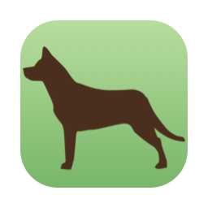

# Kelpie



Kelpie is a macOS menu bar app that shows the live state of the coding agents
running under [herdr](https://github.com/herdrdev/herdr), animated, from
outside herdr itself.

## Why it exists

herdr removed its animated agent spinners in commit `81f355fa` (released in
v0.8.0) for measured reasons, not a stylistic call. herdrdev/herdr#1862
recorded the headless server sustaining 16–23% of a CPU core with three
attached clients and two working panes: a single working pane armed a 128 ms
animation tick that forced a full render *per attached client*, so the cost
multiplied by both pane count and client count. herdrdev/herdr#967 recorded a
second symptom of the same root cause — the focused pane's cursor flickering
in lockstep with the sidebar spinner. herdr now conveys agent state with
static marks and color, which is correct for herdr's own rendering path.

Kelpie restores the animated cue from outside herdr, where the cost profile is
completely different: it is one process rewriting a few glyphs in the menu
bar, on a timer that only runs while something is actually working. That cost
does not multiply by pane count, and it does not multiply by how many herdr
clients are attached — because Kelpie isn't one of the things a herdr render
has to serve.

## What the menu bar segments mean

The menu bar item shows up to three segments, each present only when its
count is greater than zero:

| Segment | Meaning |
|---|---|
| `◉n` (red) | `n` agents are blocked, waiting on you |
| `⣾n` (yellow, animated) | `n` agents are working |
| `✓n` (green) | `n` agents are done |

Idle and unknown-status agents are not counted in the menu bar — they still
appear in the popover, but the menu bar is reserved for states that want your
attention. When nothing is blocked, working, or done, the item shows a small
dog icon drawn as a template image, so macOS keeps it legible against any menu
bar background without it competing for attention.

The working segment's spinner only animates while at least one agent is
working; the animation timer starts and stops with that condition, which is
what keeps the cost independent of pane and client count. When the system's
Reduce Motion accessibility setting is on, the spinner is replaced by a static
glyph instead.

## What clicking a row does

Clicking a row in the popover (or activating a Kelpie notification) sends
herdr's `agent.focus` for that pane, then brings the terminal hosting herdr
forward, so you land directly on the waiting agent. If no herdr client is
currently attached, Kelpie still sends the focus request and skips activating
a window — the correct pane will already be selected the next time you open
herdr.

## Notifications

Kelpie posts a notification only when an agent makes a **live transition
into** `blocked` from some other status. It does not notify:

- on launch, for agents that are already blocked when Kelpie starts up
- on reconnect, after herdr restarts or the connection drops and recovers
- on the periodic 5-minute resync, for agents that were already blocked
- on any further update, for an agent that simply stays blocked

This keeps notifications rare enough to be worth reading — you get exactly one
per genuine "an agent now needs you" event.

### Reminders

An agent still blocked some time later was never dealt with, so the one banner
it got did not do its job. Kelpie reminds you about it a minute after it
blocked, then five minutes later, then every fifteen for as long as it stays
blocked. The widening interval keeps a pane you are already walking over to
from nagging, while one you have forgotten keeps a slow heartbeat going.

Only leaving `blocked` stops the reminders — activating one brings the terminal
forward, but going to look is not the same as answering. Agents that were
already blocked when Kelpie launched are never reminded about, for the same
reason launch itself is silent.

Reminders replace each other rather than stacking: the notification is
identified by the pane, so Notification Center keeps one row per blocked agent
however long it has been waiting. They are sent as Time Sensitive, so a Focus
mode that would otherwise hold them back lets them through — someone deep
enough in Focus to have stopped watching the menu bar is exactly who this is
for.

herdr can also deliver its own system notifications. If both are active you
will see duplicates, so adjust herdr's `ui.toast.delivery` setting to avoid
that — either disable herdr's own toast delivery, or keep only one of the two
notifiers active for agent-blocked events.

## Installation

```bash
brew install --cask snaka/tap/kelpie
```

Kelpie is a menu bar app (`LSUIElement`); it has no Dock icon and no main
window. After installing, launch it from `/Applications/Kelpie.app` (or enable
"Start at login" from the popover footer so it comes back automatically).

**herdr must already be running.** Kelpie connects to herdr's socket at
`~/.config/herdr/herdr.sock` and does nothing to start herdr itself. If herdr
is not running, the menu bar item shows the resting dog icon and the
popover footer reports "herdr server not running — retrying"; Kelpie retries
the connection on an exponential backoff and picks up automatically once
herdr is available.

## Manual verification checklist

Kelpie's logic is covered by automated tests (`KelpieCore`/`KelpieClient`),
but two areas depend on OS-level state that only exists once Kelpie is
installed as a real, signed app bundle — an ad-hoc-signed debug build cannot
exercise them. Check both after installing a signed build, and before every
release.

### 1. Notification delivery and click-to-jump

An ad-hoc-signed build launched from `build/` cannot obtain notification
authorization at all: `requestAuthorization` throws `UNErrorDomain Code=1`
(`notificationsNotAllowed`), and `authorizationStatus` stays `.notDetermined`
forever. This can only be verified against the first properly signed,
installed build.

The valuable part to check is the *silence* rules, since those are what keep
notifications worth reading:

- [ ] With an agent already blocked before Kelpie launches, start Kelpie and
      confirm **no** notification fires (bootstrap must be silent).
- [ ] With Kelpie already running, drive an agent into `blocked` and confirm
      **exactly one** notification fires.
- [ ] Click the notification and confirm it brings the terminal hosting herdr
      forward, focused on the blocked pane.
- [ ] Leave the agent blocked past a 5-minute resync and confirm the resync
      itself produces nothing — the only notifications in that window are the
      reminders below.
- [ ] Leave an agent blocked and confirm reminders arrive roughly one minute,
      six minutes and twenty-one minutes after it blocked, then every fifteen.
- [ ] Answer the blocked agent and confirm the reminders stop.
- [ ] With an agent already blocked before Kelpie launches, confirm **no**
      reminder fires for it either.
- [ ] With a Focus mode active, confirm a reminder still breaks through as a
      banner rather than going straight to Notification Center.
- [ ] After several reminders for one agent, confirm Notification Center holds
      a single row for it rather than one row per reminder.

### 2. Start at login

`SMAppService` refuses to register an app that is running from a build
directory — `SMAppService.mainApp.status` reads `.notFound` and the toggle has
no real effect. This can only be verified once Kelpie is installed to
`/Applications`.

- [ ] Toggle "Start at login" on in the popover footer.
- [ ] Confirm the registration with:
      ```bash
      sfltool dumpbtm | grep -i kelpie
      ```
- [ ] Toggle it off and confirm the entry disappears from `sfltool dumpbtm`.

### Other checks worth doing by hand

- [ ] Menu bar segments match the agent counts shown in the popover.
- [ ] Popover sections appear in BLOCKED, WORKING, DONE, IDLE order, and an
      empty section (and its heading) is omitted.
- [ ] Quitting herdr shows the resting dog icon and "herdr server not
      running — retrying" in the popover footer; restarting herdr recovers
      automatically without restarting Kelpie.
- [ ] With Reduce Motion enabled in System Settings, the working segment shows
      a static glyph instead of the animated spinner.

## License

MIT — see [LICENSE](LICENSE).

The app icon incorporates the dog face from
[Noto Emoji](https://github.com/googlefonts/noto-emoji), © Google, used under
the [Apache License 2.0](https://github.com/googlefonts/noto-emoji/blob/main/LICENSE).
